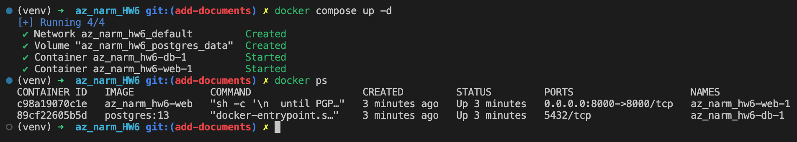
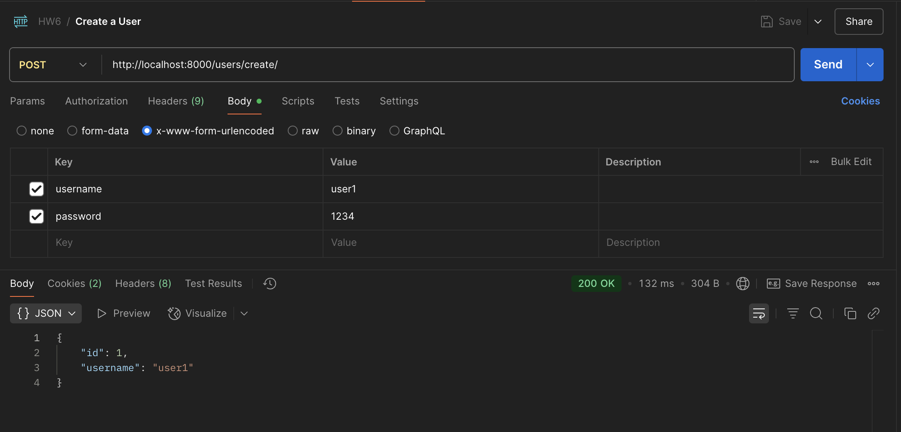
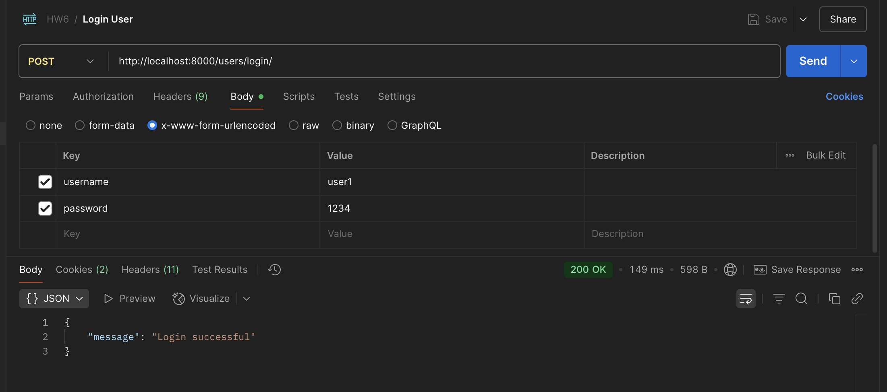
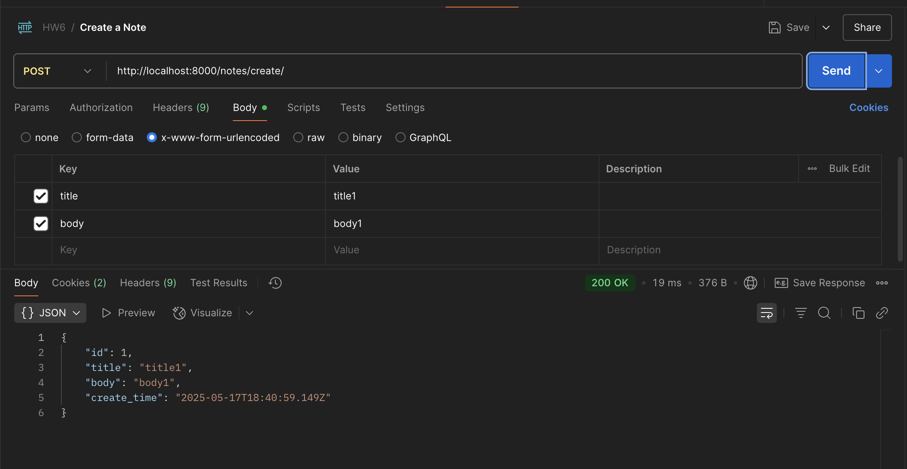
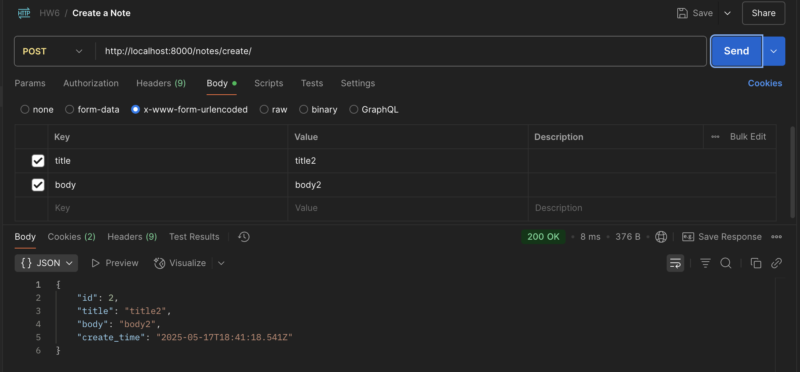
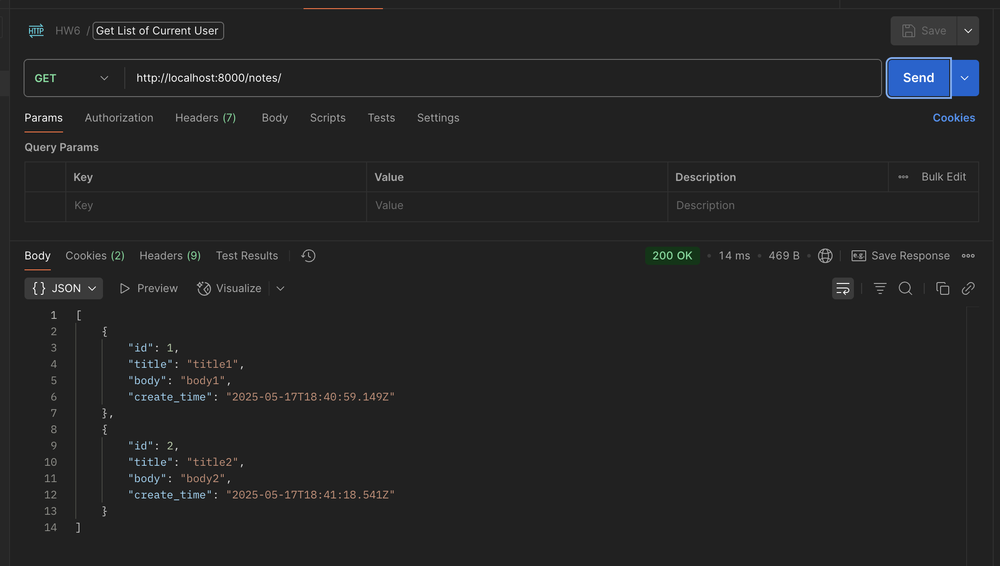
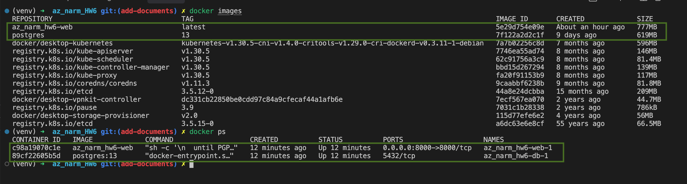
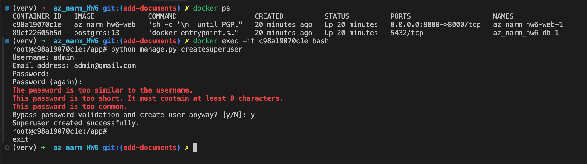

# آزمایش ششم

### [Repository link](https://github.com/thisismmf/az_narm_HW6)

## اعضای گروه

محمدامین کرمی
98105998

محمد مهدی فرهادی
99105634

دانا افاضلی
98105592

## وظایف بخش‌های مختلف پروژه
پروژه شامل دو app می‌باشد:
- user: مدل‌ها، ویو‌ها و اطلاعات مربوط به user در این اپ قرار دارد.
- note: مدل‌ها، ویو ها و وظایف مربوط به note ها در این اپ قرار دارد.

برای اینکه پروژه بتواند به دیتابیس پستگره متصل شود نیاز است که در فایل settings.py تغییرات زیر را انجام دهیم:
```python
DATABASES = {
    'default': {
        'ENGINE': 'django.db.backends.postgresql',
        'NAME':     os.environ.get('POSTGRES_DB',     'notes_db'),
        'USER':     os.environ.get('POSTGRES_USER',   'notes_user'),
        'PASSWORD': os.environ.get('POSTGRES_PASSWORD', 'secretpassword'),
        'HOST':     os.environ.get('POSTGRES_HOST',   'db'),
        'PORT':     os.environ.get('POSTGRES_PORT',   '5432'),
    }
}
```
با این تغییر، فریمورک جنگو با استفاده از engine و اطلاعاتی که از enviroment variables می‌خواند، به دیتابیس متصل خواهد شد.

برای اینکه بتوانیم از پروژه یک image و در نهایت یک container بسازیم، نیاز به یک dockerfile داریم:


1. **image پایه**: از تصویر `python:3.9-slim` به عنوان پایه استفاده می‌شود که یک نسخه سبک از پایتون 3.9 است.

2. **نصب وابستگی‌های سیستم**:
   - `gcc`: کامپایلر C برای نصب برخی پکیج‌های پایتون
   - `libpq-dev`: کتابخانه‌های مورد نیاز برای PostgreSQL
   - `postgresql-client`: ابزارهای خط فرمان PostgreSQL

3. **تنظیمات محیط کار**:
   - دایرکتوری کاری به `/app` تغییر می‌کند
   - فایل `requirements.txt` کپی شده و پکیج‌های پایتون نصب می‌شوند
   - `psycopg2-binary` برای اتصال به PostgreSQL نصب می‌شود

4. **کپی فایل‌های پروژه**:
   - تمام فایل‌های پروژه به دایرکتوری `/app` کپی می‌شوند

5. **تنظیمات محیطی**:
   - متغیر محیطی `DJANGO_SETTINGS_MODULE` برای مشخص کردن فایل تنظیمات Django تنظیم می‌شود

6. **دستور اجرا**:
   - منتظر می‌ماند تا پایگاه داده PostgreSQL آماده شود
   - migration‌های Django را اجرا می‌کند
   - سرور Django را روی پورت 8000 اجرا می‌کند

این Dockerfile به گونه‌ای طراحی شده که برنامه را به صورت خودکار و با اطمینان از آماده بودن تمام وابستگی‌ها اجرا می‌کند.

در ادامه با استفاده از docker-compose.yml، یک دیتابیس پستگره با credentials مناسب میسازیم. همچنین پروژه را با استفاده از Dockerfile نوشته شده بالا می‌آوریم و به دیتابیس متصل می‌کنیم.


1. **سرویس دیتابیس (db)**:
   - از تصویر رسمی PostgreSQL استفاده می‌کند
   - متغیرهای محیطی برای تنظیم نام دیتابیس، کاربر و رمز عبور تعریف شده‌اند
   - پورت 5432 برای دسترسی به دیتابیس در دسترس قرار می‌گیرد
   - داده‌های دیتابیس در یک volume به نام `postgres_data` ذخیره می‌شوند تا با حذف container از بین نروند

2. **سرویس وب (web)**:
   - از Dockerfile پروژه برای ساخت image استفاده می‌کند
   - به سرویس دیتابیس وابسته است و منتظر آماده شدن آن می‌ماند
   - متغیرهای محیطی برای اتصال به دیتابیس تنظیم شده‌اند
   - پورت 8000 برای دسترسی به برنامه در دسترس قرار می‌گیرد
   - فایل‌های پروژه در یک volume به نام `django_static` ذخیره می‌شوند

این فایل به ما این امکان را می‌دهد با یک دستور ساده (`docker-compose up`) تمام سرویس‌های مورد نیاز را اجرا کنیم و با یک دستور دیگر (`docker-compose down`) آن‌ها را متوقف کنیم.


## راه‌اندازی سرویس
با استفاده از دستوری `docker-compose up -d` سرویس و دیتابیس را بالا می‌آوریم:

<p align="center">
  
</p>


حال پروژه آماده‌است و امکان ارسال درخواست برای آن وجود دارد

## ارسال درخواست به وب‌سرور
با استفاده از پست‌من و اطلاعات route هایی که در اختیار داریم، درخواست‌های زیر را انجام می‌دهیم:

1. یک کاربر به نام user1 با رمز ۱۲۳۴ بسازید.

<p align="center">
  
</p>

---

2. یادداشتی با تیتر title1 و بدنه body1 برای user1 بسازید.

برای این‌کار نیاز است تا ابتدا با user1 لاگین کنیم:

<p align="center">
  
</p>


حال درخواست را ارسال می‌کنیم:

<p align="center">
  
</p>

---

3. یادداشتی با تیتر title2 و بدنه body2 برای user1 بسازید.

<p align="center">
  
</p>

---


4. همه یادداشت‌های user1 را دریافت کنید. (باید ۲ یادداشت بالا را به عنوان خروجی دریافت کنید)

<p align="center">
  
</p>

---

## تعامل با داکر

با استفاده از دستور‌های زیر image ها و container های مربوط به پروژه را به دست می‌آوریم(کادر سبز رنگ image ها و container های مربوط به پروژه را نشان می‌دهند):

<p align="center">
  
</p>

حال برای اینکه بتوانیم به کانتینر وب‌سرور متصل شویم نیاز است تا دستور exec را اجرا کنیم. برای مثال فرض می‌کنیم که میخواهیم super user ای بسازیم. پس خواهیم داشت:


<p align="center">
  
</p>


## پرسش‌ها

### 1. **وظایف Dockerfile، image و container را توضیح دهید.**

* **Dockerfile**:
  یک فایل متنی است که شامل دستوراتی است برای ساخت یک **Docker image**. این دستورات مشخص می‌کنند که چه سیستم عاملی استفاده شود، چه پکیج‌هایی نصب شود، چه فایل‌هایی کپی شود و برنامه چگونه اجرا شود.
  به‌عبارتی، **Dockerfile یک دستورالعمل ساخت image است**.

* **Docker image**:
  یک بسته‌ی فقط‌خواندنی (read-only) از تمام چیزهایی است که برای اجرای برنامه نیاز است، از جمله کد، کتابخانه‌ها، تنظیمات و...
  image را می‌توان از روی Dockerfile ساخت و می‌توان آن را روی هر سیستمی اجرا کرد که Docker روی آن نصب باشد.

* **Container**:
  یک **نمونه‌ی در حال اجرای یک Docker image** است. container مثل یک فرآیند ایزوله‌شده روی سیستم میزبان اجرا می‌شود.
  چندین container می‌توانند از یک image ساخته شوند و به صورت جداگانه اجرا شوند.

**مثال ساده برای درک تفاوت‌ها**:

* Dockerfile → دستور پخت غذا
* Docker image → غذای آماده‌شده طبق دستور
* Container → بشقابی که غذا در آن سرو شده و در حال استفاده است

---

### 2. **از Kubernetes برای انجام چه کارهایی می‌توان استفاده کرد؟ رابطه آن با Docker چیست؟**

* **Kubernetes (k8s)** یک پلتفرم متن‌باز برای **مدیریت، مقیاس‌دهی، و خودکارسازی اجرای containerها** است.

#### کاربردهای Kubernetes:

* اجرای خودکار (auto-scheduling) containerها روی ماشین‌های مختلف (nodes)
* مقیاس‌پذیری خودکار (افزایش/کاهش تعداد نمونه‌ها)
* مدیریت سلامت (health checks) و بازنشانی خودکار containerهای خراب
* به‌روزرسانی بدون توقف سرویس (rolling updates)
* ایجاد load balancing بین چند container
* مدیریت شبکه، ذخیره‌سازی، secrets و تنظیمات

#### رابطه Kubernetes و Docker:

* **Docker ابزار ساخت و اجرای container است**.
* **Kubernetes ابزار مدیریت containerها در مقیاس بالا است**.
* Kubernetes می‌تواند از Docker (یا سایر container runtimeها مثل containerd) برای اجرای containerها استفاده کند.
  به زبان ساده:
  Docker یک container را اجرا می‌کند؛ Kubernetes هزاران container را روی چندین سرور مدیریت می‌کند.

